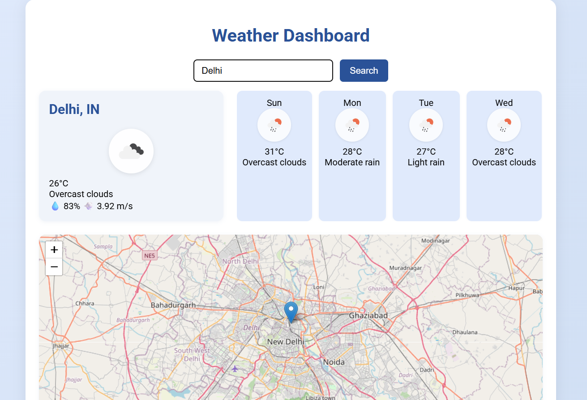

# Weather Dashboard 🌦️

A real-time, city-based Weather Dashboard with current weather data, 7-day forecast, interactive map, error handling, search debounce, responsive UI, and lazy-loading graphics.

## ✨ Features
- **🌍 City Search with Debounce**: Prevents excessive API calls while typing
- **🌤️ Current Weather Data**: Real-time temperature, humidity, wind speed, and weather conditions
- **📅 5-Day Forecast**: Daily weather predictions with averaged temperatures
- **🗺️ Interactive Map**: Centers on the searched city using Leaflet + OpenStreetMap
- **🛡️ Error Handling**: User-friendly messages for invalid input or API issues
- **📱 Responsive UI**: Mobile-friendly, modern design that works on all devices
- **⚡ Lazy-Loading Graphics**: Weather icons load efficiently for better performance
- **🎨 Beautiful Icons**: Weather icons with clear white backgrounds for better visibility

## 🛠️ Technologies Used
- **Frontend**: HTML5, CSS3, Vanilla JavaScript
- **Weather API**: [OpenWeatherMap Free APIs](https://openweathermap.org/api)
- **Maps**: [Leaflet.js](https://leafletjs.com/) + [OpenStreetMap](https://www.openstreetmap.org/)
- **Icons**: OpenWeatherMap Weather Icons

## 🚀 Quick Start

### 1. **Clone the Repository**
```bash
git clone https://github.com/Aditi53374/Weather-Dashboard.git
cd Weather-Dashboard
```

### 2. **Get Your Free API Key**
1. Go to [OpenWeatherMap](https://openweathermap.org/api)
2. Click "Sign Up" and create a free account
3. Go to your [API Keys page](https://home.openweathermap.org/api_keys)
4. Copy your API key (it may take up to 2 hours to activate)

### 3. **Configure the API Key**
1. Open `app.js` in any text editor
2. Find line 2 and replace the placeholder:
   ```javascript
   const OPENWEATHER_API_KEY = 'YOUR_API_KEY_HERE'; // Replace with your actual API key
   ```
3. Save the file

### 4. **Run the Application**
- Open `index.html` in your web browser
- Start searching for cities!

## 📸 Screenshots



*Weather Dashboard showing current weather and 5-day forecast for London*

## 📖 Usage Examples

**Search for cities using these formats:**
- `London` (city name only)
- `Paris, FR` (city with country code)
- `New York, US` (city with country code)
- `Tokyo, JP` (city with country code)

**Popular cities to try:**
- `London, GB`
- `Paris, FR`
- `New York, US`
- `Tokyo, JP`
- `Delhi, IN`
- `Sydney, AU`

## 🔧 API Information

This project uses **free OpenWeatherMap APIs**:
- **Current Weather API**: Real-time weather data
- **5-Day Forecast API**: Weather predictions
- **Geocoding API**: City name to coordinates conversion

**No paid subscription required!** 🎉

## 🐛 Troubleshooting

### Common Issues:

**"City not found"**
- Try adding country code: `London, GB`
- Check spelling of city name
- Use English city names

**"Weather data not found" or "Unauthorized"**
- Verify your API key is correct
- Wait up to 2 hours for new API keys to activate
- Check your OpenWeatherMap account status

**Icons not visible**
- Refresh the browser (F5)
- Check internet connection
- Icons have white backgrounds for better visibility

## 📱 Features in Detail

### Current Weather Display
- 🌡️ Temperature in Celsius
- 💧 Humidity percentage
- 💨 Wind speed in m/s
- 🌤️ Weather condition with icon
- 📍 City name and country

### 5-Day Forecast
- 📅 Day of the week
- 🌡️ Average daily temperature
- 🌤️ Weather condition with icon
- 📊 Daily weather description

### Interactive Map
- 🗺️ OpenStreetMap integration
- 📍 Automatic city centering
- 🎯 Location marker
- 🔍 Zoomable and interactive

## 🎨 UI/UX Features

- **Responsive Design**: Works on desktop, tablet, and mobile
- **Modern Gradient Background**: Beautiful blue gradient theme
- **Card-based Layout**: Clean, organized information display
- **Smooth Animations**: Hover effects and transitions
- **Error Handling**: Clear, helpful error messages
- **Loading States**: Visual feedback during API calls

## 📄 Project Structure
```
Weather-Dashboard/
├── index.html          # Main HTML structure
├── style.css           # Responsive styling
├── app.js              # Weather functionality
└── README.md           # This file
```

## 🤝 Contributing

Feel free to contribute to this project! Some ideas:
- Add more weather details (pressure, visibility, etc.)
- Implement temperature unit switching (Celsius/Fahrenheit)
- Add weather alerts and notifications
- Create a dark mode theme
- Add weather history charts

## 📄 License

This project is open source and available under the [MIT License](LICENSE).

## 🙏 Acknowledgments

- [OpenWeatherMap](https://openweathermap.org/) for providing free weather APIs
- [Leaflet.js](https://leafletjs.com/) for the interactive maps
- [OpenStreetMap](https://www.openstreetmap.org/) for map tiles

---

**Made by Aditi**

*Star this repository if you found it helpful! ⭐* 
